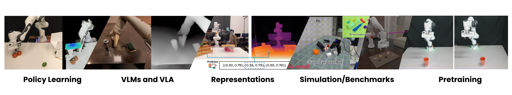

# Awesome-Robotics-3D [](https://github.com/sindresorhus/awesome) [](https://GitHub.com/Naereen/StrapDown.js/graphs/commit-activity) [](http://makeapullrequest.com)  <a href="" target='_blank'> </a>

<div align="center">
    
</div>

## ✨ About

This repo contains a curative list of **3D Vision papers relating to Robotics domain in the era of large models i.e. LLMs/VLMs**, inspired by [awesome-computer-vision](https://github.com/jbhuang0604/awesome-computer-vision) <br>

#### Please feel free to send me [pull requests](https://github.com/zubair-irshad/Awesome-Robotics-3D/blob/main/how-to-PR.md) or [email](mailto:muhammadzubairirshad@gmail.com) to add papers! 

If you find this repository useful, please consider [citing](#citation) 📝 and STARing ⭐ this list. 

Feel free to share this list with others! List curated and maintained by [Zubair Irshad](https://zubairirshad.com). If you have any questions, please get in touch!

Other relevant survey papers:

* "When LLMs step into the 3D World: A Survey and Meta-Analysis of 3D Tasks via Multi-modal Large Language Models", *arXiv, May 2024*. [[Paper](https://arxiv.org/pdf/2405.10255)]

* "A Comprehensive Study of 3-D Vision-Based Robot Manipulation", *TCYB 2021*. [[Paper](https://ieeexplore.ieee.org/document/9541299)]

---
## 🏠 Overview

  - [Policy Learning](#policy-learning)
  - [Pretraining](#pretraining)
  - [VLM and LLM](#vlm-and-llm)
  - [Representations](#representation)
  - [Simulations, Datasets and Benchmarks](#simulations-datasets-and-benchmarks)
  - [Citation](#citation)
 
---

## Policy Learning


* **3D Diffuser Actor**: "Policy diffusion with 3d scene representations", *arXiv Feb 2024*. [[Paper](https://arxiv.org/pdf/2402.10885)] [[Webpage](https://3d-diffuser-actor.github.io/)] [[Code](https://github.com/nickgkan/3d_diffuser_actor)]

* **3D Diffusion Policy**: "Generalizable Visuomotor Policy Learning via Simple 3D Representations", *RSS 2024*. [[Paper](https://arxiv.org/pdf/2403.03954)] [[Webpage](https://arxiv.org/pdf/2403.039545)] [[Code](https://github.com/YanjieZe/3D-Diffusion-Policy)]

* **DNAct**: "Diffusion Guided Multi-Task 3D Policy Learning", *arXiv Mar 2024*. [[Paper](https://arxiv.org/pdf/2403.04115 )] [[Webpage](https://dnact.github.io/)]

* **ManiCM**: "Diffusion Guided Multi-Task 3D Policy Learning", *arXiv Mar 2024*. [[Paper](https://arxiv.org/pdf/2406.01586)] [[Webpage](https://manicm-fast.github.io/)] [[Code](https://github.com/ManiCM-fast/ManiCM)]

* **HDP**: "Hierarchical Diffusion Policy for Kinematics-Aware Multi-Task Robotic Manipulation", *CVPR 2024*. [[Paper](https://arxiv.org/pdf/2403.03890)] [[Webpage](https://yusufma03.github.io/projects/hdp/)] [[Code](https://github.com/dyson-ai/hdp)]

* **Imagination Policy**: "Using Generative Point Cloud Models for Learning Manipulation Policies", *arXiv Jun 2024*. [[Paper](https://arxiv.org/pdf/2406.11740)] [[Webpage](https://haojhuang.github.io/imagine_page/)]

* **RVT**: "Generalizable Visuomotor Policy Learning via Simple 3D Representations", *CORL 2023*. [[Paper](https://arxiv.org/pdf/2306.14896)] [[Webpage](https://robotic-view-transformer.github.io/)] [[Code](https://github.com/nvlabs/rvt)]

* **Act3D**: "3D Feature Field Transformers for Multi-Task Robotic Manipulation", *CORL 2023*. [[Paper](https://arxiv.org/pdf/2306.17817)] [[Webpage](https://act3d.github.io/)] [[Code](https://github.com/zhouxian/chained-diffuser)]

* **VIHE**: "Transformer-Based 3D Object Manipulation Using Virtual In-Hand View", *arXiv, Mar 2024*. [[Paper](https://arxiv.org/pdf/2403.11461)] [[Webpage](https://vihe-3d.github.io/)] [[Code](https://github.com/doublelei/VIHE.git)]

* **SGRv2**: "Leveraging Locality to Boost Sample Efficiency in Robotic Manipulation", *arXiv, Jun 2024*. [[Paper](https://arxiv.org/pdf/2406.10615)] [[Webpage](https://sgrv2-robot.github.io/)] 

* **Sigma-Agent**: "Contrastive Imitation Learning for Language-guided Multi-Task Robotic Manipulation", *arXiv June 2024*. [[Paper](https://arxiv.org/abs/2406.09738)]

* **RVT-2**: "Learning Precise Manipulation from Few Demonstrations", *RSS 2024*. [[Paper](https://arxiv.org/pdf/2406.08545)] [[Webpage](https://robotic-view-transformer-2.github.io/)] [[Code](https://github.com/nvlabs/rvt)]

* **SAM-E**: "Leveraging Visual Foundation Model with Sequence Imitation for Embodied Manipulation", *ICML 2024*. [[Paper](https://arxiv.org/pdf/2405.19586)] [[Webpage](https://arxiv.org/abs/2405.19586)] [[Code](https://github.com/pipixiaqishi1/SAM-E)]

* **RISE**: "3D Perception Makes Real-World Robot Imitation Simple and Effective", *arXiv, Apr 2024*. [[Paper](https://arxiv.org/pdf/2404.12281)] [[Webpage](https://github.com/rise-policy/rise)]  [[Code](https://github.com/rise-policy/RISE)]

* **Polarnet**: "3D Point Clouds for Language-Guided Robotic Manipulation", *CORL 2023*. [[Paper](https://arxiv.org/pdf/2306.17817)] [[Webpage](https://www.di.ens.fr/willow/research/polarnet/)] [[Code](https://github.com/vlc-robot/polarnet/)]

* **Chaineddiffuser**: "Unifying Trajectory Diffusion and Keypose Prediction for Robotic Manipulation", *CORL 2023*. [[Paper](https://proceedings.mlr.press/v229/xian23a/xian23a.pdf)] [[Webpage](https://chained-diffuser.github.io/)] [[Code](https://github.com/zhouxian/chained-diffuser)]

* **Pointcloud_RL**: "On the Efficacy of 3D Point Cloud Reinforcement Learning", *arXiv, June 2023*. [[Paper](https://arxiv.org/abs/2306.06799)] [[Code](https://github.com/lz1oceani/pointcloud_rl)]

* **Perceiver-Actor**: "A Multi-Task Transformer for Robotic Manipulation", *CORL 2022*. [[Paper](https://arxiv.org/pdf/2209.05451)] [[Webpage](https://cliport.github.io/)] [[Code](https://github.com/cliport/cliport)]

* **CLIPort**: "What and Where Pathways for Robotic Manipulation", *CORL 2021*. [[Paper](https://arxiv.org/pdf/2109.12098.pdf)] [[Webpage](https://www.di.ens.fr/willow/research/polarnet/)] [[Code](https://github.com/vlc-robot/polarnet/)]

* **Polarnet**: "3D Point Clouds for Language-Guided Robotic Manipulation", *CORL 2023*. [[Paper](https://arxiv.org/pdf/2306.17817)] [[Webpage](https://www.di.ens.fr/willow/research/polarnet/)] [[Code](https://github.com/vlc-robot/polarnet/)]


---
## Pretraining

* **3D-MVP**: "3D Multiview Pretraining for Robotic Manipulation", *arXiv, June 2024*. [[Paper](https://arxiv.org/pdf/2406.18158)] [[Webpage](https://jasonqsy.github.io/3DMVP/)]

* **DexArt**: "Benchmarking Generalizable Dexterous Manipulation with Articulated Objects", *CVPR 2023*. [[Paper](https://www.chenbao.tech/dexart/static/paper/dexart.pdf)] [[Webpage](https://www.chenbao.tech/dexart/)] [[Code](https://github.com/Kami-code/dexart-release)]

* **RoboUniView**: "Visual-Language Model with Unified View Representation for Robotic Manipulaiton", *arXiv, Jun 2023*. [[Paper](https://arxiv.org/pdf/2406.18977)] [[Website](https://liufanfanlff.github.io/RoboUniview.github.io/)] [[Code](https://github.com/liufanfanlff/RoboUniviewd)] 

* **SUGAR**: "Pre-training 3D Visual Representations for Robotics", *CVPR 2024*. [[Paper](https://arxiv.org/pdf/2404.01491)] [[Webpage](https://cshizhe.github.io/projects/robot_sugar.html)] [[Code](https://github.com/cshizhe/robot_sugar)]

* **DPR**: "Visual Robotic Manipulation with Depth-Aware Pretraining", *arXiv, Jan 2024*. [[Paper](https://arxiv.org/pdf/2401.09038)]

* **MV-MWM**: "Multi-View Masked World Models for Visual Robotic Manipulation", *ICML 2023*. [[Paper](https://proceedings.mlr.press/v202/seo23a/seo23a.pdf)] [[Code](https://github.com/younggyoseo/MV-MWM)] 

* **Point Cloud Matters**: "Rethinking the Impact of Different Observation Spaces on Robot Learning", *arXiv, Feb 2024*. [[Paper](https://arxiv.org/pdf/2402.02500)] [[Code](https://github.com/HaoyiZhu/PointCloudMatters)] 

* **RL3D**: "Visual Reinforcement Learning with Self-Supervised 3D Representations", *IROS 2023*. [[Paper](https://arxiv.org/pdf/2210.07241)] [[Website](https://github.com/YanjieZe/rl3d)] [[Code](https://github.com/YanjieZe/rl3d)] 

---

## VLM and LLM

* **3D-VLA**: 3D Vision-Language-Action Generative World Model", *ICML 2024*. [[Paper](https://arxiv.org/pdf/2403.09631)] [[Website](https://vis-www.cs.umass.edu/3dvla/)] [[Code](https://github.com/UMass-Foundation-Model/3D-VLA)] 

* **RoboPoint**: "A Vision-Language Model for Spatial Affordance Prediction for Robotics", *arXiv, June 2024*. [[Paper](https://arxiv.org/pdf/2210.07241)] [[Website](https://robo-point.github.io/)]

* **SpatialVLM**: "Endowing Vision-Language Models with Spatial Reasoning Capabilities", *CVPR 2024*. [[Paper](https://arxiv.org/abs/2401.12168)] [[Website](https://spatial-vlm.github.io/)] [[Code](https://spatial-vlm.github.io/#community-implementation)] 

* **Scene-LLM**: "Extending Language Model for 3D Visual Understanding and Reasoning", *arXiv, Mar 2024*. [[Paper](https://arxiv.org/pdf/2403.11401)] 

* **ManipLLM**: "Embodied Multimodal Large Language Model for Object-Centric Robotic Manipulation ", *CVPR 2024*. [[Paper](https://openaccess.thecvf.com/content/CVPR2024/papers/Li_ManipLLM_Embodied_Multimodal_Large_Language_Model_for_Object-Centric_Robotic_Manipulation_CVPR_2024_paper.pdf)] [[Website](https://sites.google.com/view/manipllm)] [[Code](https://github.com/clorislili/ManipLLM)] 

* **MOKA**: "Open-Vocabulary Robotic Manipulation through Mark-Based Visual Prompting", *RSS 2024*. [[Paper](https://arxiv.org/pdf/2403.03174)] [[Website](https://moka-manipulation.github.io/)] [[Code](https://github.com/moka-manipulation/moka)] 

* **Agent3D-Zero**: "An Agent for Zero-shot 3D Understanding", *arXIv, Mar 2024*. [[Paper](https://arxiv.org/pdf/2403.11835)] [[Website](https://zhangsha1024.github.io/Agent3D-Zero/)] [[Code](https://github.com/zhangsha1024/Agent3d-zero-code)] 

* **MultiPLY**: "A Multisensory Object-Centric Embodied Large Language Model in 3D World", *CVPR 2024*. [[Paper](https://arxiv.org/pdf/2401.08577)] [[Website](https://vis-www.cs.umass.edu/multiply/)] [[Code](https://github.com/UMass-Foundation-Model/MultiPLY)] 

* **ThinkGrasp**: "A Vision-Language System for Strategic Part Grasping in Clutter", *arXiv, Jul 2024*. [[Paper](https://arxiv.org/abs/2407.11298)] [[Website](https://h-freax.github.io/thinkgrasp_page/)]

* **VoxPoser**: "Composable 3D Value Maps for Robotic Manipulation with Language Models", *CORL 2023*. [[Paper](https://arxiv.org/pdf/2307.05973)] [[Website](https://voxposer.github.io/)] [[Code](https://github.com/huangwl18/VoxPoser)] 

* **Dream2Real**: "Zero-Shot 3D Object Rearrangement with Vision-Language Models", *ICRA 2024*. [[Paper](https://arxiv.org/pdf/2312.04533.pdf)] [[Website](https://www.robot-learning.uk/dream2real)] [[Code](https://github.com/FlyCole/Dream2Real)] 

* **LEO**: "An Embodied Generalist Agent in 3D World", *ICML 2024*. [[Paper](https://arxiv.org/pdf/2311.12871)] [[Website](https://embodied-generalist.github.io/)] [[Code](https://github.com/embodied-generalist/embodied-generalist)] 

* **SpatialPIN**: "Enhancing Spatial Reasoning Capabilities of Vision-Language Models through Prompting and Interacting 3D Priors", *arXiv, Mar 2024*. [[Paper](https://arxiv.org/pdf/2403.13438)] [[Website](https://dannymcy.github.io/zeroshot_task_hallucination/)]

* **COME-robot**: "Closed-Loop Open-Vocabulary Mobile Manipulation with GPT-4V", *arXiv, Apr 2024*. [[Paper](https://arxiv.org/pdf/2404.10220)] [[Website](https://come-robot.github.io/)]

* **3D-LLM**: "Open-Vocabulary Robotic Manipulation through Mark-Based Visual Prompting", *Neurips 2023*. [[Paper](https://arxiv.org/pdf/2307.12981)] [[Website](https://vis-www.cs.umass.edu/3dllm/)] [[Code](https://github.com/UMass-Foundation-Model/3D-LLM)] 

* **VLMaps**: "Visual Language Maps for Robot Navigation", *ICRA 2023*. [[Paper](https://arxiv.org/pdf/2210.05714)] [[Website](https://vlmaps.github.io/)] [[Code](https://github.com/vlmaps/vlmaps.gita)] 

* **MoMa-LLM**: "Language-Grounded Dynamic Scene Graphs for Interactive Object Search with Mobile Manipulation", *RA-L 2024*. [[Paper](https://arxiv.org/pdf/2403.08605)] [[Website](http://moma-llm.cs.uni-freiburg.de/)] [[Code](https://github.com/robot-learning-freiburg/MoMa-LLM)]

* **LGrasp6D**: "Language-Driven 6-DoF Grasp Detection Using Negative Prompt Guidance", *ECCV 2024*. [[Paper](https://arxiv.org/pdf/2407.13842)] [[Website](https://airvlab.github.io/grasp-anything/)]

* **OpenAD**: "Open-Vocabulary Affordance Detection in 3D Point Clouds", *IROS 2023*. [[Paper](https://arxiv.org/pdf/2303.02401)] [[Website](https://openad2023.github.io/)] [[Code](https://github.com/Fsoft-AIC/Open-Vocabulary-Affordance-Detection-in-3D-Point-Clouds)]

* **3DAPNet**: "Language-Conditioned Affordance-Pose Detection in 3D Point Clouds", *ICRA 2024*. [[Paper](https://arxiv.org/pdf/2309.10911)] [[Website](https://3dapnet.github.io/)] [[Code](https://github.com/Fsoft-AIC/Language-Conditioned-Affordance-Pose-Detection-in-3D-Point-Clouds)]

* **OpenKD**: "Open-Vocabulary Affordance Detection using Knowledge Distillation and Text-Point Correlation", *ICRA 2024*. [[Paper](https://arxiv.org/pdf/2309.10932)] [[Code](https://github.com/Fsoft-AIC/Open-Vocabulary-Affordance-Detection-using-Knowledge-Distillation-and-Text-Point-Correlation)]

* **PARIS3D**: "Reasoning Based 3D Part Segmentation Using Large Multimodal Model", *ECCV 2024*. [[Paper](https://arxiv.org/abs/2404.03836)] [[Code](https://github.com/AmrinKareem/PARIS3D)]


---
## Representation

* **RAM**: "RAM: Retrieval-Based Affordance Transfer for Generalizable Zero-Shot Robotic Manipulation", *arXiv July 2024*. [[Paper](https://arxiv.org/pdf/2407.04689)] [[Webpage](https://yxkryptonite.github.io/RAM/)] [[Code](https://github.com/yxKryptonite/RAM_code)]

* **GNFactor**: "Multi-Task Real Robot Learning with Generalizable Neural Feature Fields", *CORL 2023*. [[Paper](https://arxiv.org/pdf/2308.16891)] [[Webpage](https://yanjieze.com/GNFactor/)] [[Code](https://github.com/YanjieZe/GNFactor)]

* **ManiGaussian**: "Dynamic Gaussian Splatting for Multi-task Robotic Manipulation", *ECCV 2024*. [[Paper](https://arxiv.org/pdf/2403.08321)] [[Webpage](https://guanxinglu.github.io/ManiGaussian/)] [[Code](https://github.com/GuanxingLu/ManiGaussian)]

* **GaussianGrasper**: "3D Language Gaussian Splatting for Open-vocabulary Robotic Grasping", *arXiv Mar 2024*. [[Paper](https://arxiv.org/pdf/2403.09637.pdf)] [[Webpage](https://mrsecant.github.io/GaussianGrasper/)] [[Code](https://github.com/MrSecant/GaussianGrasper)]

* **ORION**: "Vision-based Manipulation from Single Human Video with Open-World Object Graphs", *arXiv May 2024*. [[Paper](https://arxiv.org/pdf/2405.20321)] [[Webpage](https://ut-austin-rpl.github.io/ORION-release)]

* **ConceptGraphs**: "Open-Vocabulary 3D Scene Graphs for Perception and Planning", *ICRA 2024*. [[Paper](http://arxiv.org/pdf/2309.16650)] [[Webpage](https://concept-graphs.github.io/)] [[Code](https://github.com/concept-graphs/concept-graphs)]

* **SparseDFF**: "Sparse-View Feature Distillation for One-Shot Dexterous Manipulation", *ICLR 2024*. [[Paper](https://arxiv.org/pdf/2310.16838)] [[Webpage](https://helloqxwang.github.io/SparseDFF/)]

* **GROOT**: "Learning Generalizable Manipulation Policies with Object-Centric 3D Representations", *CORL 2023*. [[Paper](http://arxiv.org/abs/2310.14386)] [[Webpage](https://ut-austin-rpl.github.io/GROOT/)] [[Code](https://github.com/UT-Austin-RPL/GROOT)]

* **Distilled Feature Fields**: "Enable Few-Shot Language-Guided Manipulation", *CORL 2023*. [[Paper](https://arxiv.org/pdf/2308.07931)] [[Webpage](https://f3rm.github.io/)] [[Code](https://github.com/f3rm/f3rm)]

* **SGR**: "A Universal Semantic-Geometric Representation for Robotic Manipulation", *CORL 2023*. [[Paper](https://arxiv.org/pdf/2306.10474.pdf)] [[Webpage](https://semantic-geometric-representation.github.io/)] [[Code](https://github.com/TongZhangTHU/sgr)]

* **OVMM**: "Open-vocabulary Mobile Manipulation in Unseen Dynamic Environments with 3D Semantic Maps", *arXiv, Jun 2024*. [[Paper](https://arxiv.org/pdf/2406.18115)] 

* **CLIP-Fields**: "Weakly Supervised Semantic Fields for Robotic Memory", *RSS 2023*. [[Paper](https://arxiv.org/pdf/2210.05663)] [[Webpage](https://mahis.life/clip-fields)] [[Code](https://github.com/notmahi/clip-fields)]

* **NeRF in the Palm of Your Hand**: "Corrective Augmentation for Robotics via Novel-View Synthesis", *CVPR 2023*. [[Paper](https://arxiv.org/pdf/2301.08556)] [[Webpage](https://bland.website/spartn/)]

* **JCR**: "Unifying Scene Representation and Hand-Eye Calibration with 3D Foundation Models", *arXiv, Apr 2024*. [[Paper](https://arxiv.org/abpdfs/2404.11683v1)] [[Code](https://github.com/tomtang502/arm_3d_reconstruction)]

* **D3Fields**: "Dynamic 3D Descriptor Fields for Zero-Shot Generalizable Robotic Manipulation", *arXiv, Sep 2023*. [[Paper](https://arxiv.org/pdf/2309.16118)] [[Webpage](https://robopil.github.io/d3fields/)] [[Code](https://github.com/WangYixuan12/d3fields)]

* **SayPlan**: "Grounding Large Language Models using 3D Scene Graphs for Scalable Robot Task Planning", *CORL 2023*. [[Paper](https://openreview.net/pdf?id=wMpOMO0Ss7a)] [[Webpage](https://sayplan.github.io/)]

* **Dex-NeRF**: "Using a Neural Radiance field to Grasp Transparent Objects", *CORL 2021*. [[Paper](https://arxiv.org/pdf/2110.14217)] [[Webpage](https://sites.google.com/view/dex-nerf)]

---
## Simulations, Datasets and Benchmarks

* **The Colosseum**: "A Benchmark for Evaluating Generalization for Robotic Manipulation", *RSS 2024*. [[Paper](https://arxiv.org/pdf/2402.08191)] [[Website](https://robot-colosseum.github.io/)] [[Code](https://github.com/robot-colosseum/robot-colosseum)] 

* **OpenEQA**: "Embodied Question Answering in the Era of Foundation Models", *CVPR 2024*. [[Paper](https://open-eqa.github.io/assets/pdfs/paper.pdf)] [[Website](https://open-eqa.github.io/)] [[Code](https://github.com/facebookresearch/open-eqa)] 

* **DROID**: "A Large-Scale In-the-Wild Robot Manipulation Dataset", *RSS 2024*. [[Paper](https://arxiv.org/pdf/2403.12945)] [[Website](https://droid-dataset.github.io/)] [[Code](https://github.com/droid-dataset/droid)] 

* **RH20T**: "A Comprehensive Robotic Dataset for Learning Diverse Skills in One-Shot", *ICRA 2024*. [[Paper](https://arxiv.org/pdf/2307.00595)] [[Website](https://rh20t.github.io/)] [[Code](https://github.com/rh20t/rh20t_api)] 

* **Gen2Sim**: "A Comprehensive Robotic Dataset for Learning Diverse Skills in One-Shot", *ICRA 2024*. [[Paper](https://arxiv.org/pdf/2310.18308)] [[Website](https://gen2sim.github.io/)] [[Code](https://github.com/pushkalkatara/Gen2Sim)] 

* **BEHAVIOR Vision Suite**: "Customizable Dataset Generation via Simulation", *CVPR 2024*. [[Paper](https://arxiv.org/pdf/2405.09546)] [[Website](https://behavior-vision-suite.github.io/)] [[Code](https://github.com/behavior-vision-suite/behavior-vision-suite.github.io)] 

* **RoboCasa**: "Large-Scale Simulation of Everyday Tasks for Generalist Robots", *RSS 2024*. [[Paper](https://arxiv.org/pdf/2406.02523)] [[Website](https://robocasa.ai/)] [[Code](https://github.com/robocasa/robocasa)] 

* **ARNOLD**: "ARNOLD: A Benchmark for Language-Grounded Task Learning With Continuous States in Realistic 3D Scenes", *ICCV 2023*. [[Paper](https://arxiv.org/pdf/2304.04321)] [[Webpage](https://arnold-benchmark.github.io/)] [[Code](https://github.com/arnold-benchmark/arnold)]

* **VIMA**: "General Robot Manipulation with Multimodal Prompts", *ICML 2023*. [[Paper](https://arxiv.org/pdf/2210.03094)] [[Website](https://vimalabs.github.io/)] [[Code](https://github.com/vimalabs/VIMA)] 

* **ManiSkill2**: "A Unified Benchmark for Generalizable Manipulation Skills", *ICLR 2023*. [[Paper](https://arxiv.org/pdf/2302.04659)] [[Website](https://maniskill2.github.io/)] [[Code](https://github.com/haosulab/ManiSkill2)] 

* **Robo360**: "A 3D Omnispective Multi-Material Robotic Manipulation Dataset", *arxiv, Dec 2023*. [[Paper](https://arxiv.org/pdf/2312.06686)]

* **AR2-D2**: "Training a Robot Without a Robot", *CORL 2023*. [[Paper](https://arxiv.org/pdf/2306.13818)] [[Website](https://ar2d2.site/)] [[Code](https://github.com/jiafei1224/AR2-D2)] 

* **Habitat 2.0**: "Training Home Assistants to Rearrange their Habitat", *Neuips 2021*. [[Paper](https://arxiv.org/pdf/2106.14405)] [[Website](https://aihabitat.org/docs/habitat2/)] [[Code](https://github.com/facebookresearch/habitat-lab)] 

* **VL-Grasp**: "a 6-Dof Interactive Grasp Policy for Language-Oriented Objects in Cluttered Indoor Scenes", *IROS 2023*. [[Paper](https://ieeexplore.ieee.org/document/10341379)] [[Code](https://github.com/luyh20/vl-grasp)] 

* **OCID-Ref**: "A 3D Robotic Dataset with Embodied Language for Clutter Scene Grounding", *NAACL 2021*. [[Paper](https://arxiv.org/pdf/2103.07679)] [[Code](https://github.com/lluma/OCID-Ref)]  

* **ManipulaTHOR**: "A Framework for Visual Object Manipulation", *CVPR 2021*. [[Paper](https://arxiv.org/pdf/2104.11213.pdf)] [[Website](https://ai2thor.allenai.org/manipulathor/)] [[Code](https://ai2thor.allenai.org/manipulathor/)] 

* **RoboTHOR**: "An Open Simulation-to-Real Embodied AI Platform", *CVPR 2020*. [[Paper](https://arxiv.org/pdf/2004.06799)] [[Website](https://ai2thor.allenai.org/robothor/)] [[Code](https://github.com/allenai/ai2thor)]

* **ManiSkill2**: "A Unified Benchmark for Generalizable Manipulation Skills", *ICLR 2023*. [[Paper](https://arxiv.org/pdf/2302.04659)] [[Website](https://maniskill2.github.io/)] [[Code](https://github.com/haosulab/ManiSkill2)]

* **HabiCrowd**: "HabiCrowd: A High Performance Simulator for Crowd-Aware Visual Navigation", *IROS 2024*. [[Paper](https://arxiv.org/pdf/2306.11377)] [[Website](https://habicrowd.github.io/)] [[Code](https://github.com/Fsoft-AIC/HabiCrowd)]

----
## Citation
If you find this repository useful, please consider citing this list:
```
@misc{irshad2024roboticd3D,
    title = {Awesome Robotics 3D - A curated list of resources on 3D vision papers relating to robotics},
    author = {Muhammad Zubair Irshad},
    journal = {GitHub repository},
    url = {https://github.com/zubair-irshad/Awesome-Robotics-3D},
    year = {2024},
}
```
